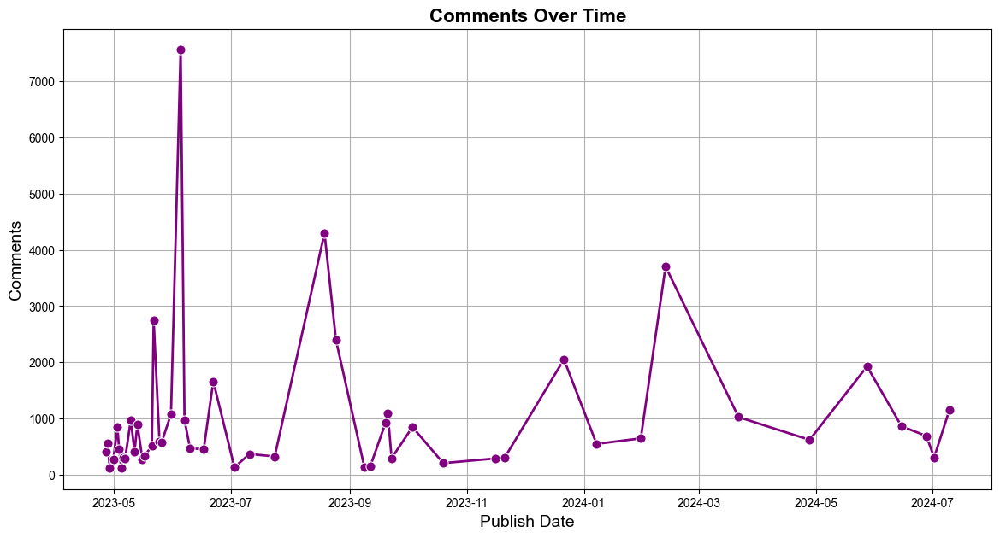

# Youtube Data Analysis part-2

# Extracting Video Details and Statistics from YouTube Channel


```python
from googleapiclient.discovery import build
import pandas as pd
import matplotlib.pyplot as plt
import seaborn as sns
import warnings

```


```python
# Suppress specific warnings
warnings.filterwarnings("ignore", category=UserWarning, module="IPython.core.pylabtools")
```


```python
# Initialize YouTube API
api_key = 'Api Key'
youtube = build('youtube', 'v3', developerKey=api_key)
```


```python
# Function to get video details
def get_videos_from_channel(channel_id, max_results=50):
    request = youtube.search().list(
        part="snippet",
        channelId=channel_id,
        maxResults=max_results,
        order="date"
    )
    response = request.execute()
    return response['items']

# Function to get video statistics
def get_video_statistics(video_id):
    request = youtube.videos().list(
        part="statistics",
        id=video_id
    )
    response = request.execute()
    return response['items'][0]['statistics']
```


```python
# Get videos from a channel
channel_id = 'UCBwmMxybNva6P_5VmxjzwqA'
videos = get_videos_from_channel(channel_id)
```


```python
# Extract video details and statistics

data = []

for video in videos:
    # Safely get the 'videoId' to avoid KeyError
    video_id = video['id'].get('videoId')
    if video_id:
        video_details = youtube.videos().list(
            part="snippet,statistics",
            id=video_id
        ).execute()
        if video_details['items']:  # Check if the list is not empty
            snippet = video_details['items'][0]['snippet']
            statistics = video_details['items'][0]['statistics']
            data.append({
                # 'video_id': video_id,
                'Title': snippet['title'],
                'Description': snippet['description'],
                'Tags': snippet.get('tags', []),
                'Publish_date': snippet['publishedAt'],
                'Views': int(statistics.get('viewCount', 0)),
                'Likes': int(statistics.get('likeCount', 0)),
                'Dislikes': int(statistics.get('dislikeCount', 0)),
                'Comments': int(statistics.get('commentCount', 0))
            })

```


```python
# Create DataFrame
video_data = pd.DataFrame(data)
```


```python
video_data.dtypes
```


    Title           object
    Description     object
    Tags            object
    Publish_date    object
    Views            int64
    Likes            int64
    Dislikes         int64
    Comments         int64
    dtype: object


```python
video_data.count() # default setup maximum count is 50
```


    Title           49
    Description     49
    Tags            49
    Publish_date    49
    Views           49
    Likes           49
    Dislikes        49
    Comments        49
    dtype: int64


```python
video_data.head(10)
```


<div>
<style scoped>
    .dataframe tbody tr th:only-of-type {
        vertical-align: middle;
    }

    .dataframe tbody tr th {
        vertical-align: top;
    }

    .dataframe thead th {
        text-align: right;
    }
</style>
<table border="1" class="dataframe">
  <thead>
    <tr style="text-align: right;">
      <th></th>
      <th>Title</th>
      <th>Description</th>
      <th>Tags</th>
      <th>Publish_date</th>
      <th>Views</th>
      <th>Likes</th>
      <th>Dislikes</th>
      <th>Comments</th>
    </tr>
  </thead>
  <tbody>
    <tr>
      <th>0</th>
      <td>What's wrong with Engineering Degree ? What ca...</td>
      <td>Start early for your Tech Placement &amp; Internsh...</td>
      <td>[C++, C++ coding, C++ full course, C++ placeme...</td>
      <td>2024-07-09 16:36:01+00:00</td>
      <td>311422</td>
      <td>16680</td>
      <td>0</td>
      <td>1156</td>
    </tr>
    <tr>
      <th>1</th>
      <td>Major Issue for students! For Jobs, student sh...</td>
      <td></td>
      <td>[]</td>
      <td>2024-07-01 15:51:47+00:00</td>
      <td>827781</td>
      <td>60073</td>
      <td>0</td>
      <td>305</td>
    </tr>
    <tr>
      <th>2</th>
      <td>What is Docker? Simply Explained by Shradha Ma'am</td>
      <td>New Placement Batch \nSigma 3.0 : https://www....</td>
      <td>[C++, C++ coding, C++ full course, C++ placeme...</td>
      <td>2024-06-27 16:20:54+00:00</td>
      <td>210347</td>
      <td>7742</td>
      <td>0</td>
      <td>688</td>
    </tr>
    <tr>
      <th>3</th>
      <td>OOPs Tutorial in One Shot | Object Oriented Pr...</td>
      <td>Hope this class helps you with your Placement ...</td>
      <td>[C++, C++ coding, C++ full course, C++ placeme...</td>
      <td>2024-06-14 15:38:50+00:00</td>
      <td>400839</td>
      <td>10539</td>
      <td>0</td>
      <td>863</td>
    </tr>
    <tr>
      <th>4</th>
      <td>How to start Coding in 1st Year? for College S...</td>
      <td>Hope this session helps you in your career!\n\...</td>
      <td>[C++, C++ coding, C++ full course, C++ placeme...</td>
      <td>2024-05-27 16:36:20+00:00</td>
      <td>656400</td>
      <td>35800</td>
      <td>0</td>
      <td>1926</td>
    </tr>
    <tr>
      <th>5</th>
      <td>Tier 3 to Off Campus Google &amp; Microsoft | How ...</td>
      <td>Shreya is our Alpha &amp; Delta student. Coming fr...</td>
      <td>[C++, C++ coding, C++ full course, C++ placeme...</td>
      <td>2024-04-27 17:04:45+00:00</td>
      <td>424948</td>
      <td>13918</td>
      <td>0</td>
      <td>620</td>
    </tr>
    <tr>
      <th>6</th>
      <td>Bringing Complete Placement Course  : C++ &amp; Da...</td>
      <td>📌New C++ &amp; DSA Batch : https://www.apnacollege...</td>
      <td>[C++, C++ coding, C++ full course, C++ placeme...</td>
      <td>2024-03-21 15:49:26+00:00</td>
      <td>194868</td>
      <td>9136</td>
      <td>0</td>
      <td>1025</td>
    </tr>
    <tr>
      <th>7</th>
      <td>Python Tutorial for Beginners - Full Course (w...</td>
      <td>You can join the batch using the below link.\n...</td>
      <td>[C++, C++ coding, C++ full course, C++ placeme...</td>
      <td>2024-02-12 14:24:29+00:00</td>
      <td>3388498</td>
      <td>67689</td>
      <td>0</td>
      <td>3703</td>
    </tr>
    <tr>
      <th>8</th>
      <td>What to do if not getting job? Jobless in Tech...</td>
      <td>🔥Sigma Placement Feb'24 Batch (Development + D...</td>
      <td>[C++, C++ coding, C++ full course, C++ placeme...</td>
      <td>2024-01-30 16:33:19+00:00</td>
      <td>272189</td>
      <td>13829</td>
      <td>0</td>
      <td>647</td>
    </tr>
    <tr>
      <th>9</th>
      <td>5 Best Websites to find Jobs and Internships i...</td>
      <td>These are the platforms we covered : \n1. Link...</td>
      <td>[C++, C++ coding, C++ full course, C++ placeme...</td>
      <td>2024-01-07 14:56:18+00:00</td>
      <td>419970</td>
      <td>18879</td>
      <td>0</td>
      <td>548</td>
    </tr>
  </tbody>
</table>
</div>


```python

```

### Top 10 videos of Darshil Parmar


```python
top10_videos = video_data.sort_values(by = 'Views', ascending = False).head(10)
```


```python
top10_videos
```


<div>
<style scoped>
    .dataframe tbody tr th:only-of-type {
        vertical-align: middle;
    }

    .dataframe tbody tr th {
        vertical-align: top;
    }

    .dataframe thead th {
        text-align: right;
    }
</style>
<table border="1" class="dataframe">
  <thead>
    <tr style="text-align: right;">
      <th></th>
      <th>Title</th>
      <th>Description</th>
      <th>Tags</th>
      <th>Publish_date</th>
      <th>Views</th>
      <th>Likes</th>
      <th>Dislikes</th>
      <th>Comments</th>
    </tr>
  </thead>
  <tbody>
    <tr>
      <th>29</th>
      <td>CSS Tutorial for Beginners | Complete CSS with...</td>
      <td>Notes - https://drive.google.com/drive/folders...</td>
      <td>[C++, C++ coding, C++ full course, C++ placeme...</td>
      <td>2023-06-04T16:32:22Z</td>
      <td>7187711</td>
      <td>102737</td>
      <td>0</td>
      <td>7561</td>
    </tr>
    <tr>
      <th>21</th>
      <td>SQL - Complete Course in 3 Hours | SQL One Sho...</td>
      <td>You can join the  NEW Web Development batch us...</td>
      <td>[C++, C++ coding, C++ full course, C++ placeme...</td>
      <td>2023-08-18T17:38:13Z</td>
      <td>6463725</td>
      <td>111652</td>
      <td>0</td>
      <td>4299</td>
    </tr>
    <tr>
      <th>7</th>
      <td>Python Tutorial for Beginners - Full Course (w...</td>
      <td>You can join the batch using the below link.\n...</td>
      <td>[C++, C++ coding, C++ full course, C++ placeme...</td>
      <td>2024-02-12T14:24:29Z</td>
      <td>3388498</td>
      <td>67689</td>
      <td>0</td>
      <td>3703</td>
    </tr>
    <tr>
      <th>10</th>
      <td>JavaScript Tutorial (2024) for Beginners to Pr...</td>
      <td>Notes available at :  https://drive.google.com...</td>
      <td>[C++, C++ coding, C++ full course, C++ placeme...</td>
      <td>2023-12-21T14:39:41Z</td>
      <td>2607884</td>
      <td>40051</td>
      <td>0</td>
      <td>2051</td>
    </tr>
    <tr>
      <th>20</th>
      <td>Complete Git and GitHub Tutorial for Beginners</td>
      <td>Link for GitHub Notes : https://drive.google.c...</td>
      <td>[C++, C++ coding, C++ full course, C++ placeme...</td>
      <td>2023-08-24T16:49:21Z</td>
      <td>2435322</td>
      <td>55631</td>
      <td>0</td>
      <td>2397</td>
    </tr>
    <tr>
      <th>39</th>
      <td>ChatGPT Tutorial - for all College students &amp; ...</td>
      <td>You can join the  NEW Web Development batch us...</td>
      <td>[chatgpt, gpt, ai, generative ai, prompts, cod...</td>
      <td>2023-05-09T16:54:22Z</td>
      <td>2205008</td>
      <td>51561</td>
      <td>0</td>
      <td>975</td>
    </tr>
    <tr>
      <th>17</th>
      <td>Interview Question | C Programming Language</td>
      <td></td>
      <td>[]</td>
      <td>2023-09-19T15:09:41Z</td>
      <td>2165497</td>
      <td>160044</td>
      <td>0</td>
      <td>929</td>
    </tr>
    <tr>
      <th>35</th>
      <td>How to make an Impressive LinkedIn Profile?</td>
      <td></td>
      <td>[]</td>
      <td>2023-05-16T17:58:53Z</td>
      <td>2103630</td>
      <td>146666</td>
      <td>0</td>
      <td>334</td>
    </tr>
    <tr>
      <th>25</th>
      <td>Building AMAZON Clone for Beginners | Project ...</td>
      <td>Link for Project Resources : https://drive.goo...</td>
      <td>[C++, C++ coding, C++ full course, C++ placeme...</td>
      <td>2023-06-21T17:15:09Z</td>
      <td>1908070</td>
      <td>39935</td>
      <td>0</td>
      <td>1660</td>
    </tr>
    <tr>
      <th>38</th>
      <td>How to become a UI UX Designer?</td>
      <td>#shorts\n🔥Alpha 4.0 Placement Batch (Java+DSA)...</td>
      <td>[C++, C++ coding, C++ full course, C++ placeme...</td>
      <td>2023-05-11T15:31:17Z</td>
      <td>1645399</td>
      <td>132050</td>
      <td>0</td>
      <td>411</td>
    </tr>
  </tbody>
</table>
</div>


### Data Visualisation


```python
# List of colors for the bars
colors = sns.color_palette("husl", len(top10_videos))

ax = sns.barplot(x='Views', y='Title', data=top10_videos, hue='Title', palette=colors, dodge=False, legend=False)

```


    

    


```python

```

# Trends in YouTube Video Engagement Metrics Over Time

## 1. Views Over Time

### This plot shows the trend in video views over time. The blue line indicates the overall trend, while red data points highlight specific view counts on individual dates.


```python
# Convert Publish_date to datetime
video_data['Publish_date'] = pd.to_datetime(video_data['Publish_date'])

# Plotting views over time
plt.figure(figsize=(14, 7))
sns.lineplot(
    data=video_data, 
    x='Publish_date', 
    y='Views', 
    color='royalblue',           # Line color
    marker='o',                  # Data points marker
    markerfacecolor='red',       # Data points color
    markeredgewidth=2,           # Edge width for the data points
    linewidth=2                  # Line width
)
plt.title('Views Over Time', fontsize=16, fontweight='bold')
plt.xlabel('Publish Date', fontsize=14)
plt.ylabel('Views', fontsize=14)
plt.grid(True)
plt.show()
```


    

    


```python

```


```python

```

## 2. Likes Over Time

### This plot illustrates the trend in the number of likes over time. The line is colored in green with markers for each data point.


```python
plt.figure(figsize=(14, 7))
sns.lineplot(data=video_data, x='Publish_date', y='Likes', color='green', marker='o', linestyle='-', linewidth=2, markersize=8)
plt.title('Likes Over Time', fontsize=16, fontweight='bold')
plt.xlabel('Publish Date', fontsize=14)
plt.ylabel('Likes', fontsize=14)
plt.grid(True)
plt.show()
```


    

    


```python

```

## 3. Dislikes Over Time:

## This plot displays the changes in the number of dislikes over time, with a red line and markers for clarity.


```python
plt.figure(figsize=(14, 7))
sns.lineplot(data=video_data, x='Publish_date', y='Dislikes', color='red', marker='o', linestyle='-', linewidth=2, markersize=8)
plt.title('Dislikes Over Time', fontsize=16, fontweight='bold')
plt.xlabel('Publish Date', fontsize=14)
plt.ylabel('Dislikes', fontsize=14)
plt.grid(True)
plt.show()

```


    

    


```python

```

## 4. Comments Over Time

 ### This plot represents the trend in the number of comments over time. The line is purple with markers to highlight each data point.


```python
plt.figure(figsize=(14, 7))
sns.lineplot(data=video_data, x='Publish_date', y='Comments', color='purple', marker='o', linestyle='-', linewidth=2, markersize=8)
plt.title('Comments Over Time', fontsize=16, fontweight='bold')
plt.xlabel('Publish Date', fontsize=14)
plt.ylabel('Comments', fontsize=14)
plt.grid(True)
plt.show()

```


    

    


```python

```

## Sentiment Analysis:

### Analyze the sentiment of comments using tools like TextBlob to gauge overall audience sentiment.


```python
from textblob import TextBlob
import pandas as pd


# Convert all values in 'Comments' to strings
video_data['Comments'] = video_data['Comments'].astype(str)

# Add a new column for sentiment polarity
video_data['Sentiment'] = video_data['Comments'].apply(lambda comment: TextBlob(comment).sentiment.polarity)

# Plotting sentiment over time
plt.figure(figsize=(14, 7))
sns.lineplot(
    data=video_data, 
    x='Publish_date', 
    y='Sentiment', 
    color='blue', 
    marker='o', 
    markerfacecolor='red', 
    markeredgewidth=2, 
    linewidth=2
)
plt.title('Audience Sentiment Over Time', fontsize=16, fontweight='bold')
plt.xlabel('Publish Date', fontsize=14)
plt.ylabel('Sentiment', fontsize=14)
plt.grid(True)
plt.show()
```


    

    


```python

```


```python

```


```python
video_data.head(20)
```


<div>
<style scoped>
    .dataframe tbody tr th:only-of-type {
        vertical-align: middle;
    }

    .dataframe tbody tr th {
        vertical-align: top;
    }

    .dataframe thead th {
        text-align: right;
    }
</style>
<table border="1" class="dataframe">
  <thead>
    <tr style="text-align: right;">
      <th></th>
      <th>Title</th>
      <th>Description</th>
      <th>Tags</th>
      <th>Publish_date</th>
      <th>Views</th>
      <th>Likes</th>
      <th>Dislikes</th>
      <th>Comments</th>
    </tr>
  </thead>
  <tbody>
    <tr>
      <th>0</th>
      <td>What's wrong with Engineering Degree ? What ca...</td>
      <td>Start early for your Tech Placement &amp; Internsh...</td>
      <td>[C++, C++ coding, C++ full course, C++ placeme...</td>
      <td>2024-07-09T16:36:01Z</td>
      <td>311806</td>
      <td>16700</td>
      <td>0</td>
      <td>1157</td>
    </tr>
    <tr>
      <th>1</th>
      <td>Major Issue for students! For Jobs, student sh...</td>
      <td></td>
      <td>[]</td>
      <td>2024-07-01T15:51:47Z</td>
      <td>828888</td>
      <td>60165</td>
      <td>0</td>
      <td>305</td>
    </tr>
    <tr>
      <th>2</th>
      <td>What is Docker? Simply Explained by Shradha Ma'am</td>
      <td>New Placement Batch \nSigma 3.0 : https://www....</td>
      <td>[C++, C++ coding, C++ full course, C++ placeme...</td>
      <td>2024-06-27T16:20:54Z</td>
      <td>210577</td>
      <td>7744</td>
      <td>0</td>
      <td>688</td>
    </tr>
    <tr>
      <th>3</th>
      <td>OOPs Tutorial in One Shot | Object Oriented Pr...</td>
      <td>Hope this class helps you with your Placement ...</td>
      <td>[C++, C++ coding, C++ full course, C++ placeme...</td>
      <td>2024-06-14T15:38:50Z</td>
      <td>401317</td>
      <td>10551</td>
      <td>0</td>
      <td>863</td>
    </tr>
    <tr>
      <th>4</th>
      <td>How to start Coding in 1st Year? for College S...</td>
      <td>Hope this session helps you in your career!\n\...</td>
      <td>[C++, C++ coding, C++ full course, C++ placeme...</td>
      <td>2024-05-27T16:36:20Z</td>
      <td>656808</td>
      <td>35826</td>
      <td>0</td>
      <td>1926</td>
    </tr>
    <tr>
      <th>5</th>
      <td>Tier 3 to Off Campus Google &amp; Microsoft | How ...</td>
      <td>Shreya is our Alpha &amp; Delta student. Coming fr...</td>
      <td>[C++, C++ coding, C++ full course, C++ placeme...</td>
      <td>2024-04-27T17:04:45Z</td>
      <td>425091</td>
      <td>13923</td>
      <td>0</td>
      <td>620</td>
    </tr>
    <tr>
      <th>6</th>
      <td>Bringing Complete Placement Course  : C++ &amp; Da...</td>
      <td>📌New C++ &amp; DSA Batch : https://www.apnacollege...</td>
      <td>[C++, C++ coding, C++ full course, C++ placeme...</td>
      <td>2024-03-21T15:49:26Z</td>
      <td>194895</td>
      <td>9136</td>
      <td>0</td>
      <td>1025</td>
    </tr>
    <tr>
      <th>7</th>
      <td>Python Tutorial for Beginners - Full Course (w...</td>
      <td>You can join the batch using the below link.\n...</td>
      <td>[C++, C++ coding, C++ full course, C++ placeme...</td>
      <td>2024-02-12T14:24:29Z</td>
      <td>3389556</td>
      <td>67717</td>
      <td>0</td>
      <td>3702</td>
    </tr>
    <tr>
      <th>8</th>
      <td>What to do if not getting job? Jobless in Tech...</td>
      <td>🔥Sigma Placement Feb'24 Batch (Development + D...</td>
      <td>[C++, C++ coding, C++ full course, C++ placeme...</td>
      <td>2024-01-30T16:33:19Z</td>
      <td>272192</td>
      <td>13830</td>
      <td>0</td>
      <td>647</td>
    </tr>
    <tr>
      <th>9</th>
      <td>5 Best Websites to find Jobs and Internships i...</td>
      <td>These are the platforms we covered : \n1. Link...</td>
      <td>[C++, C++ coding, C++ full course, C++ placeme...</td>
      <td>2024-01-07T14:56:18Z</td>
      <td>420027</td>
      <td>18882</td>
      <td>0</td>
      <td>548</td>
    </tr>
    <tr>
      <th>10</th>
      <td>JavaScript Tutorial (2024) for Beginners to Pr...</td>
      <td>Notes available at :  https://drive.google.com...</td>
      <td>[C++, C++ coding, C++ full course, C++ placeme...</td>
      <td>2023-12-21T14:39:41Z</td>
      <td>2608349</td>
      <td>40057</td>
      <td>0</td>
      <td>2051</td>
    </tr>
    <tr>
      <th>11</th>
      <td>Is DSA Compulsory? #tech #coding #placement</td>
      <td>#shorts</td>
      <td>[C++, C++ coding, C++ full course, C++ placeme...</td>
      <td>2023-11-20T14:20:19Z</td>
      <td>692453</td>
      <td>57578</td>
      <td>0</td>
      <td>298</td>
    </tr>
    <tr>
      <th>12</th>
      <td>How to make Ultimate Resume ? Step by step gui...</td>
      <td>Resume Template Link : https://drive.google.co...</td>
      <td>[C++, C++ coding, C++ full course, C++ placeme...</td>
      <td>2023-11-15T16:42:57Z</td>
      <td>459593</td>
      <td>13362</td>
      <td>0</td>
      <td>288</td>
    </tr>
    <tr>
      <th>13</th>
      <td>How to learn Data Science? In Short</td>
      <td>#shorts</td>
      <td>[C++, C++ coding, C++ full course, C++ placeme...</td>
      <td>2023-10-19T15:41:19Z</td>
      <td>486440</td>
      <td>41395</td>
      <td>0</td>
      <td>206</td>
    </tr>
    <tr>
      <th>14</th>
      <td>A Brief History of JavaScript</td>
      <td>#shorts</td>
      <td>[C++, C++ coding, C++ full course, C++ placeme...</td>
      <td>2023-10-03T14:00:01Z</td>
      <td>528108</td>
      <td>51663</td>
      <td>0</td>
      <td>848</td>
    </tr>
    <tr>
      <th>15</th>
      <td>Interview Question #3 | C Programming Language...</td>
      <td>#shorts</td>
      <td>[C++, C++ coding, C++ full course, C++ placeme...</td>
      <td>2023-09-22T17:18:51Z</td>
      <td>545597</td>
      <td>51674</td>
      <td>0</td>
      <td>293</td>
    </tr>
    <tr>
      <th>16</th>
      <td>How to Improve English Speaking for Interviews...</td>
      <td>Hi, if you want to learn Complete Full Stack D...</td>
      <td>[C++, C++ coding, C++ full course, C++ placeme...</td>
      <td>2023-09-20T17:28:37Z</td>
      <td>1374982</td>
      <td>61001</td>
      <td>0</td>
      <td>1091</td>
    </tr>
    <tr>
      <th>17</th>
      <td>Interview Question | C Programming Language</td>
      <td></td>
      <td>[]</td>
      <td>2023-09-19T15:09:41Z</td>
      <td>2166009</td>
      <td>160095</td>
      <td>0</td>
      <td>931</td>
    </tr>
    <tr>
      <th>18</th>
      <td>Insertion Sort | Simply Explained</td>
      <td>#shorts</td>
      <td>[C++, C++ coding, C++ full course, C++ placeme...</td>
      <td>2023-09-11T13:03:54Z</td>
      <td>350745</td>
      <td>25800</td>
      <td>0</td>
      <td>144</td>
    </tr>
    <tr>
      <th>19</th>
      <td>How to Score Better in College Exams?</td>
      <td>#shorts</td>
      <td>[C++, C++ coding, C++ full course, C++ placeme...</td>
      <td>2023-09-08T13:43:32Z</td>
      <td>281803</td>
      <td>29761</td>
      <td>0</td>
      <td>128</td>
    </tr>
  </tbody>
</table>
</div>


```python
# Convert this dataframe to CSV File
```


```python
video_data.to_csv('Apna_Collage_Channel_Analysis.csv')  
```


```python

```


```python

```
